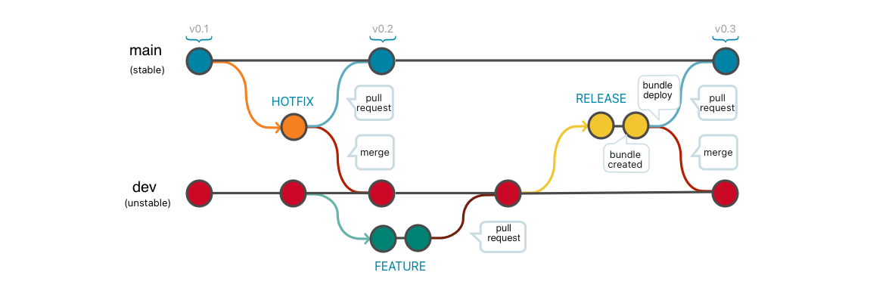

# OSML Contributing Guidelines

Thank you for your interest in contributing to our project! This document will guide you through the process of
contributing to our repository using a release-based GitFlow workflow. Please read the guidelines carefully in order to
submit your pull requests effectively.

## Table of Contents

- [Release-based GitFlow](#release-based-gitflow)
- [Branches Overview](#branches-overview)
- [Use Cases](#use-cases)
   - [Develop a new feature](#develop-a-new-feature)
   - [Develop multiple features in parallel](#develop-multiple-features-in-parallel)
   - [Create and deploy a release](#create-and-deploy-a-release)
   - [Production hot fix](#production-hot-fix)
- [Code Style](#code-style)
- [Commit Messages](#commit-messages)
- [Issue Tracking](#issue-tracking)

## Release-based GitFlow

We follow a release-based GitFlow branching model to manage our codebase. It involves different types of branches to
ensure proper version control and collaboration. The primary branches in this workflow are:

note- `main`: This branch represents the latest production-ready state of the project code.
- `dev`: This branch is used as the integration branch, combining all feature branches for a specific release.
- `release-x.x`: Branches in the format of `release-x.x` are used to prepare a specific release.
- `feature/x`: Feature branches are created for the development of new features or significant enhancements.

## Branches

Here's a brief description of the supported branches in our repository:



| Branch           | Protected? | Base Branch        | Description                                                                                                                                                                                                   |
|:-----------------|:-----------|:-------------------|:--------------------------------------------------------------------------------------------------------------------------------------------------------------------------------------------------------------|
| `main`           | YES        | N/A                | What is live in production (**stable**).<br/>A pull request is required to merge code into `main`.                                                                                                            |
| `dev`            | YES        | `main`             | The latest state of development (**unstable**).                                                                                                                                                               |
| `feature/*`      | NO         | `dev`              | Cutting-edge features (**unstable**). These branches are used for any maintenance features / active development.                                                                                              |
| `release-vX.Y.Z` | NO         | `dev`              | A temporary release branch that follows the [semver](http://semver.org/) versioning. This is what is sent to UAT.<br/>A pull request is required to merge code into any `release-vX.Y.Z` branch.              |
| `hotfix/*`       | NO         | `main`             | These are bug fixes against production.<br/>This is used because develop might have moved on from the last published state.<br/>Remember to merge this back into develop and any release branches.            |

## Use Cases

### Develop a new feature


1. Make sure your `dev` branch is up-to-date

2. Create a feature branch based off of `dev`

   ```
   $ git checkout dev
   $ git checkout -b feature-new-documentation
   $ git push --set-upstream feature-new-documentation
   ```

3. Develop the code for the new feature and commit. Push your changes often. This
   allows others to see your changes and suggest improvements/changes as well as
   provides a safety net should your hard drive crash.

    ```
    $ ... make changes
    $ git add -A .
    $ git commit -m "Add new documentation files"
    $ ... make more changes
    $ git add -A .
    $ git commit -m "Fix some spelling errors"
    $ git push
    ```

4. Navigate to the project on [GitHub](www.github.com) and open a pull request with
   the following branch settings:
    * Base: `dev`
    * Compare: `feature-new-documentation`

5. When the pull request was reviewed, merge and close it and delete the
   `feature-new-documentation` branch.

### Develop multiple features in parallel

There's nothing special about that. Each developer follows the above [Develop a new feature](#develop-a-new-feature) process.

### Create and deploy a release


1. Merge `main` into `dev` to ensure the new release will contain the
   latest production code. This reduces the chance of a merge conflict during
   the release.

   ```
   $ git checkout dev
   $ git merge main
   ```

2. Create a new `release-vX.Y.Z` release branch off of `dev`.

   ```
   $ git checkout -b release-vX.Y.Z
   $ git push --set-upstream release-vX.Y.Z
   ```

3. Stabilize the release by using bugfix branches off of the `release-vX.Y.Z` branch
   (the same way you would do a feature branch off of `dev`).

   ```
   $ git checkout release-vX.Y.Z
   $ git checkout -b fix-label-alignment
   $ git push --set-upstream fix-label-alignment
   ... do work
   $ git commit -m "Adjust label to align with button"
   $ git push
   ```

4. When the code is ready to release, navigate to the project on
   [GitHub](www.github.com) and open a pull request with the following branch
   settings:
    * Base: `main`
    * Compare: `release-vX.Y.Z`
      Paste the Release Checklist into the PR body. Each project should define a release
      checklist. It will vary across projects, but you can refer to the Astro
      [Release](https://github.com/mobify/astro/blob/develop/RELEASE.md) document for an example.

5. At some point in the checklist you will merge the release branch into `main`.
   You can do this by using the "Merge pull request" button on the release PR.

6. Now you are ready to create the actual release. Navigate to the project page
   on GitHub and draft a new release with the following settings:
    * Tag version: `vX.Y.Z`
    * Target: `main`
    * Release title: `Release vX.Y.Z`
    * Description: Includes a high-level list of things changed in this release.
      Click `Publish release`.

7. Merge the `release-vX.Y.Z` into `dev`.

    ```
    $ git checkout dev
    $ git merge release-vX.Y.Z
    $ git push
    ```

8. Finish off the tasks in the release checklist. Once everything is done, close
   the release PR.

9. Delete the release branch on GitHub.

### Production hot fix

A production hotfix is very similar to a full-scale release except that you do
your work in a branch taken directly off of `main`. Hotfixes are useful in cases
where you want to patch a bug in a released version, but `dev` has unreleased
code in it already.

**TBD: Insert diagram**

1. Create a hot fix branch based off of `main`.

   ```
   $ git checkout main
   $ git checkout -b hotfix-documentation-broken-links
   $ git push --set-upstream origin hotfix-documentation-broken-links
   ```

2. Add a test case to validate the bug, fix the bug, and commit.

   ```
   ... add test, fix bug, verify
   $ git add -A .
   $ git commit -m "Fix broken links"
   $ git push
   ```

3. Navigate to the project on [GitHub](www.github.com) and open a pull request
   with the following branch settings:
   * Base: `main`
   * Compare: `hotfix-documentation-broken-links`
     Paste your release checklist into the PR and work through the PR to get the
     hotfix into production.

4. At some point in the checklist you will merge the hotfix branch into `main`.
   You can do this by using the "Merge pull request" button on the release PR.

5. Now that the hotfix code is in `main` you are ready to create the actual
   release. Navigate to the project page on GitHub and draft a new release with
   the following settings:
   * Tag version: `vX.Y.Z`
   * Target: `main`
   * Release title: `Release vX.Y.Z (hotfix)`
   * Description: Includes a high-level list of things changed in this release.

Click `Publish release`.

*Note: Hotfix releases _are_ actual releases. You should bump at least the
patch part of the version when releasing a hotfix, and so even hotfixes go
through the process of creating a release like this.*

1. Merge the `hotfix-documentation-broken-links` into `dev`.

   ```
   $ git checkout dev
   $ git merge hotfix-documentation-broken-links
   $ git push
   ```

2. Finish off the tasks in the release checklist. Once everything is done, close
   the hotfix PR.

## Code Style

We maintain a consistent code style throughout the project, so please ensure your changes align with our existing style.
Take a look at the existing codebase to understand the patterns and conventions we follow.

## Commit Messages

Clear and concise commit messages are important for keeping the project history readable. Please follow these rules when
writing commit messages:

- Start with a capitalized summary line (50 characters or fewer) describing the change.
- Provide additional details in the body of the commit message (if required).
- Use present tense and imperative mood in commit messages ("Fix bug" instead of "Fixed bug").
- Reference any relevant issues or pull requests using the appropriate syntax (`#123`, `GH-456`, etc.).

For additional rules relating to commit messages, see [conventional commits](https://www.conventionalcommits.org/en/v1.0.0/#summary)

## Issue Tracking

We utilize the issue tracking functionality of GitHub to manage our project's roadmap and track bugs or feature requests.
If you encounter any problems or have a new idea, please search the issues to ensure it hasn't already been reported.
If necessary, open a new issue providing a clear description, steps to reproduce, and any relevant information.

We greatly appreciate your effort and contribution to our project! Let's build something awesome together!
